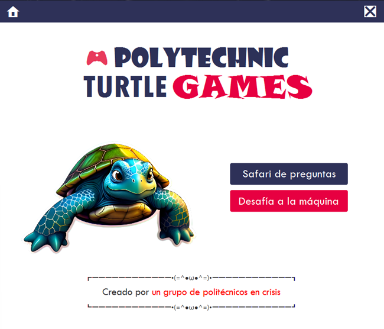

# 💼 Portafolio de Kevin Salazar

Bienvenido a mi sitio personal. Aquí puedes encontrar información sobre mí, mis proyectos y las tecnologías que he aprendido a lo largo del curso.

🔗 **Sitio publicado**: [https://kevinjsalazar.github.io/KevinJSalazar](https://kevinjsalazar.github.io/KevinJSalazar)

📧 **Correo institucional**: [kejosala@espol.edu.ec](mailto:kejosala@espol.edu.ec)

---

## 📄 Contenido

- [Información personal](#información-personal)
- [Proyectos Destacados](#proyectos-destacados)
- [Tecnologías aprendidas](#tecnologías-aprendidas)
- [Contacto](#contacto)
- [Intereses](#intereses)
- [Código QR](#código-qr)

---

## 👤 Información personal

- **Nombre**: Kevin Joel Salazar Rodríguez  
- **Ocupación**: Estudiante  
- **Residencia**: Guayaquil, Ecuador  

---

## 🚀 Proyectos Destacados

### 📦 Proyecto: Sistema de compra y venta de vehículos

- **Descripción**: Un programa que simula la compra y venta de vehículos, con funciones adicionales como listas de deseados y filtros. No utiliza una base de datos real, ya que es solo una demostración de funcionamiento, siendo uno de mis primeros proyectos realizados con Java.
- **Asignatura**: Programación Orientada a Objetos
- **Fecha de finalización**: 4 de septiembre de 2023
- **Tecnologías**: Java
- 🔗 [Repositorio](https://github.com/KevinJSalazar/VentasTTV-POO-Proyecto)

---

### 📊 Proyecto: Adivina en qué animal estoy pensando

- **Descripción**: Un juego en Java en el que la máquina adivina un animal en el que estás pensando, haciendo uso de un árbol AVL para realizar la búsqueda. Además, cuenta con un modo de juego donde eres tú quien debe adivinar el animal elegido por la máquina. 
- **Asignatura**: Estructuras de Datos
- **Fecha de finalización**: 19 de agosto de 2024
- **Tecnologías**: Java, estructuras de datos personalizadas
- 🔗 [Repositorio](https://github.com/KevinJSalazar/Proyecto2-EstructurasDatos)

---

### 🗃️ Proyecto: Gestión de base de datos de una página web

- **Descripción**: Una ventana para gestionar la información de una base de datos en una página que ofrece servicios de cuidado de mascotas. Con una interfaz sencilla pero bien estructurada, este proyecto permite interactuar con los datos y facilitar la administración de registros. Basado en PetBacker.
- **Asignatura**: Sistemas de Bases de Datos
- **Fecha de finalización**: 2 de junio de 2024
- **Tecnologías**: MySQL, HTML, Java
- 🔗 [Repositorio](https://github.com/KevinJSalazar/ProyectoSBD)

---

## 🛠️ Tecnologías aprendidas

---

## 📬 Contacto

---

## 🎯 Intereses

- Programación
- Electrónica
- Música y arte
- Psicología

---

## 📷 Código QR

> Escanea el siguiente código para acceder a mi portafolio publicado:

